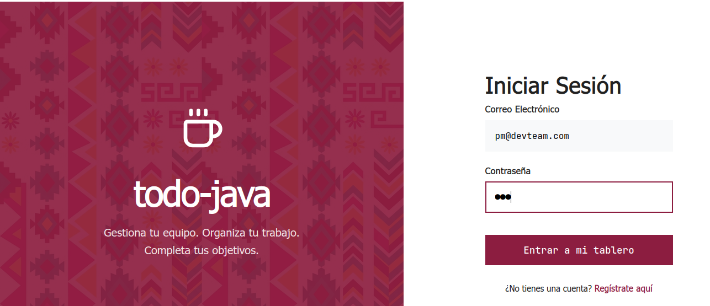
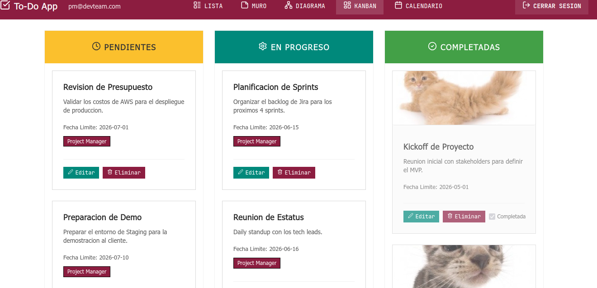
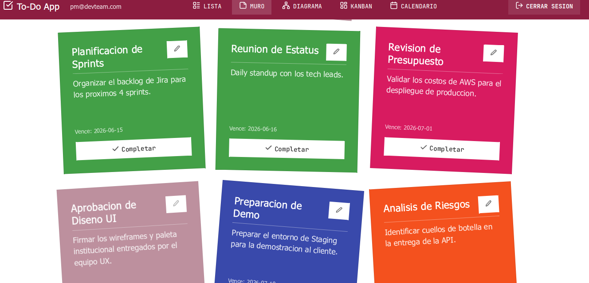

# To-Do Java

Aplicacion To-Do simple






## Arquitectura y Stack Tecnologico

- **Backend:** Java 17, Spring Boot 3.2.5, Spring Security (JWT), Spring Data JPA, PostgreSQL.
- **Frontend:** Angular 16 (Standalone Components), Reactive Forms, RxJS.
- **Base de Datos:** PostgreSQL gestionada mediante Flyway para control de versiones (migraciones).
- **Infraestructura:** Docker y docker-compose.

## Requisitos Previos

- Docker y Docker Compose instalados.

## Instrucciones de Ejecucion Local

1. Crea un archivo `.env` en la raíz del proyecto para definir variables de entorno:
   ```env
   POSTGRES_USER=postgres
   POSTGRES_PASSWORD=postgres
   POSTGRES_DB=todo_db
   JWT_SECRET=ClaveTodoJavaSuperSecreta1234567
   JWT_EXPIRATION=3600000
   ```
2. Levanta los contenedores y construye las imagenes (API, Base de Datos, Frontend):
   ```bash
   docker-compose up -d --build
   ```
3. La base de datos (PostgreSQL) estara disponible internamente y en el puerto `5432`. Flyway inicializara el esquema automaticamente.
4. El Backend (API REST) estara expuesto en `http://localhost:8080`.
5. El Frontend de desarrollo (Angular) estara expuesto en `http://localhost:4200`.

## Scripts de Prueba (CLI)
En la raiz del proyecto se encuentra el script interactivo `cli-verifier.sh` el cual permite probar rapidamente todos los endpoints de la API (registro, login, CRUD y subida de archivos) sin necesidad de Postman o interfaz grafica.

## Endpoints de la API

### Autenticacion
- `POST /api/auth/register`: Crea un nuevo usuario y retorna un JWT.
  - Body: `{ "email": "user@example.com", "password": "password" }`
- `POST /api/auth/login`: Autenticacion de usuario y retorna un JWT.
  - Body: `{ "email": "user@example.com", "password": "password" }`

### Tareas (Protegidas con Header `Authorization: Bearer <token>`)
- `GET /api/tasks`: Obtiene todas las tareas del usuario autenticado.
- `GET /api/tasks/{id}`: Obtiene una tarea especifica.
- `POST /api/tasks`: Crea una nueva tarea (Soporta arreglo de `assigneeIds` para multiples responsables).
- `PUT /api/tasks/{id}`: Actualiza una tarea existente.
- `DELETE /api/tasks/{id}`: Elimina una tarea.
- `POST /api/tasks/{id}/attachments`: Sube una imagen o archivo adjunto a la tarea (`multipart/form-data`).

## Caracteristicas de Diseño (UI/UX)
- Implementa Standalone Components en Angular para una arquitectura puramente modular.
- Incluye validaciones en frontend y backend (Centralizado con `@ControllerAdvice`).
- Múltiples Vistas de Datos (Data Viz): Lista tradicional, Tablero Kanban interactivo (Drag & Drop), Muro de Notas (Sticky Board), Diagrama de Red (Network Graph) agrupado por equipos, y Vista de Calendario.
- Panel lateral (Sidebar) con sincronización de estado global en tiempo real mediante `ViewService` y `BehaviorSubject`.
- Evaluacion de usabilidad (Heuristicas de Nielsen) disponible en la carpeta `docs`.

## Pruebas (Testing)

**Backend (Java/Spring Boot - JUnit + Mockito):**
```bash
docker run --rm -v $(pwd)/backend:/app:z -w /app maven:3.9-eclipse-temurin-17-alpine mvn test
```

**Frontend (Angular - Jasmine/Karma):**
```bash
docker run --rm -v $(pwd)/frontend:/app:z -w /app node:18-alpine sh -c "npm install && npm run test -- --watch=false --browsers=ChromeHeadless"
```
